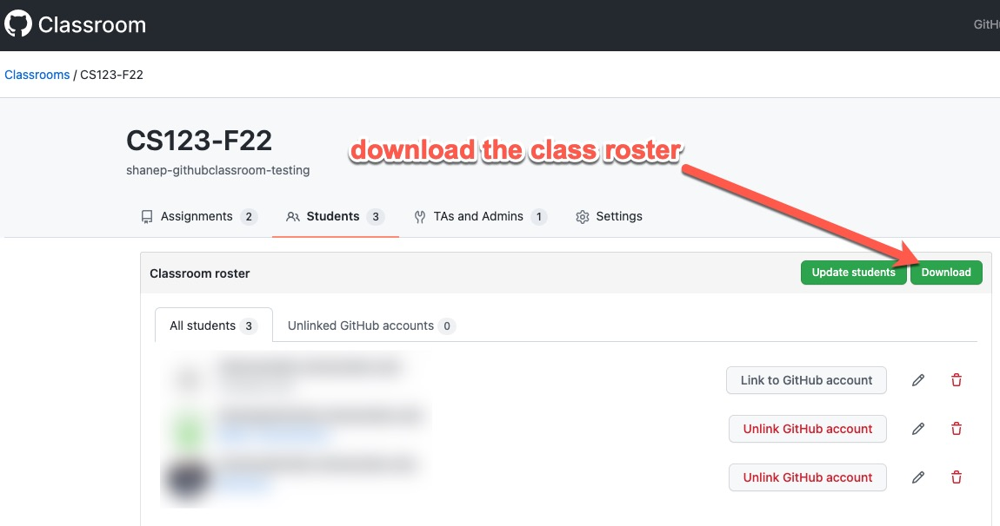
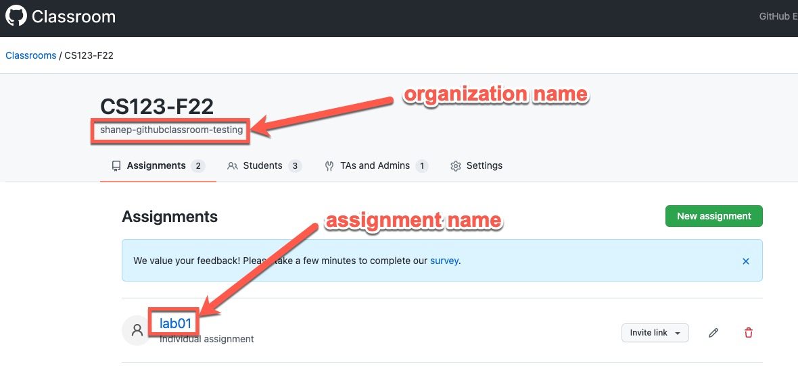
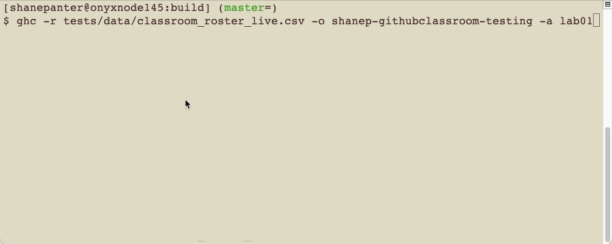

# ghc


1. Clone this repo: ```git clone https://github.com/shanep/ghclass && cd ghclass```
2. `./build-release.sh`
3. The executable ghc should be in the top level build directory ready to use
4. Install `ghc` in your path e.x. `$HOME/bin`
4. Run the exe to get the help message

## Overview

This is a command line tool to download your classroom.github.com repositories. It requires using
the ssh protocol (https is not supported).

Please read the [official
docs](https://docs.github.com/en/github/authenticating-to-github/connecting-to-github-with-ssh)
to setup your ssh keys.

After you have created your classroom on github and your students have all accepted their
first assignment you need to [download the roster](https://docs.github.com/en/education/manage-coursework-with-github-classroom/teach-with-github-classroom/manage-classrooms#about-classroom-rosters) (classroom_roster.csv) and place it in the
directory that you want your repos downloaded to.

``` bash
$ ./ghc
-r <class roster>             :[required] File name of the class roster (ex. class_roster.csv)
-o <organization>             :[required] Name of your Github organization
-a <assignment name>          :[required] Name of the assignment
-h                            :Help
$ ./ghc -r classroom_roster.csv -o shanep-classroom -a p1
Cloning: git@github.com:shanep-classroom/p1-BSU-ShanePanter to: /Users/shane/repos/ghclass/data/BSU-ShanePanter

```

### Get the class roster



### Get the assignment name and organization



## Groups

To download groups make sure and download your roster from classroom.github.com with group names.
This tool should automatically detect that the roster has group names and will download the
assignment into a folder named after the team.


## Demo



## Extra help

Extra help regarding using github classrooms can be found
[here](https://shanepanter.com/teaching/github-classroom-instructor.html).
