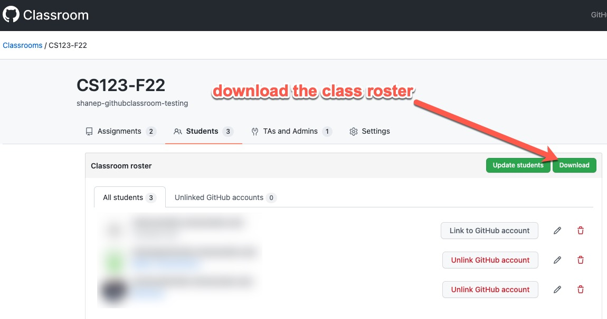
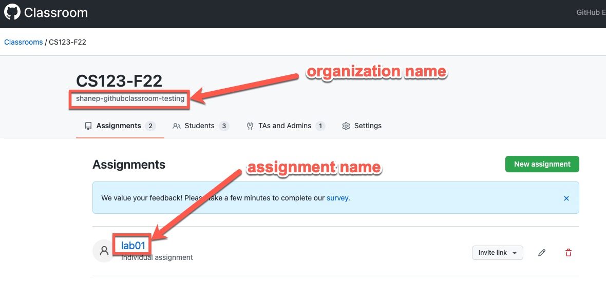
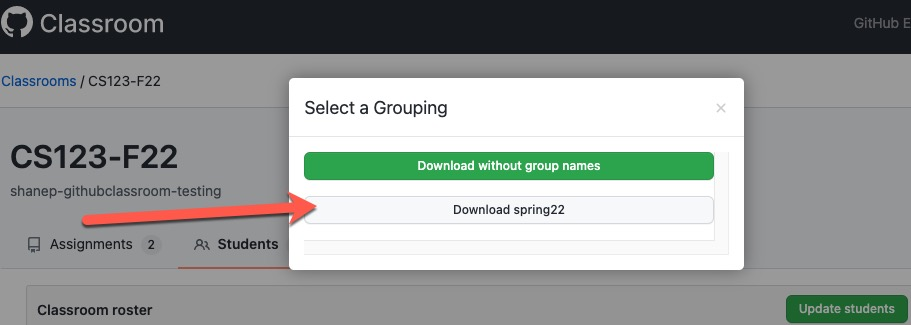

# ghclass

[](https://github.com/shanep/ghclass/actions/workflows/run-tests.yml) [](https://github.com/shanep/ghclass/actions/workflows/npm-publish.yml)

These instructions will walk you through setup and downloading your students submissions.
These instructions assume that you have already [configured a classroom](https://shanepanter.com/teaching/github-classroom-setup.html) and you are ready to get your students submissions.

GitHub released and [official cli](https://github.com/github/gh-classroom) for classrooms that you can use as an alternative.

## Configure GitHub Authorization

You need to [Setup the gh command line app](https://shanepanter.com/cs155/configure-github.html) first. **AFTER** you have followed the [instructions](https://shanepanter.com/cs155/configure-github.html) you can confirm that set everything up correctly using the command `gh auth status`

```bash
> gh auth status
github.com
  ✓ Logged in to github.com as shanep (keyring)
  ✓ Git operations for github.com configured to use ssh protocol.
  ✓ Token: gho_************************************
  ✓ Token scopes: admin:public_key, gist, read:org, repo
```

After you have created your classroom on github and your students have all
accepted their first assignment you need to [download the
roster](https://docs.github.com/en/education/manage-coursework-with-github-classroom/teach-with-github-classroom/manage-classrooms#about-classroom-rosters)
(classroom_roster.csv) and place it in the directory that you want your repos
downloaded to.

## Installing

- [Install Nodejs](https://nodejs.org/en/download)
- Linux users can install node through their [package manager](https://nodejs.org/en/download/package-manager)

Once node and npm are installed you can install globally with `npm install ghclass -g`.

## Using

After you have created your classroom on github and your students have all accepted their
first assignment you need to [download the roster](https://docs.github.com/en/education/manage-coursework-with-github-classroom/teach-with-github-classroom/manage-classrooms#about-classroom-rosters) (classroom_roster.csv).




``` bash
$ ghc --help
Usage: ghc [options]

CLI downloader for github repositories created with classrooms.github.com

Options:
  -V, --version              output the version number
  -r, --roster <name>        File name of the class roster (ex. class_roster.csv)
  -o, --organization <name>  Name of your Github organization
  -a, --assignment <name>    Name of the assignment
  -h, --help                 display help for command
```

## Groups

To download groups make sure and download your roster from classroom.github.com with group names.
This tool should automatically detect that the roster has group names and will download the
assignment into a folder named after the team.



## Demo


## Docs

- [Setting up Classrooms](https://shanepanter.com/teaching/github-classroom-setup.html)
