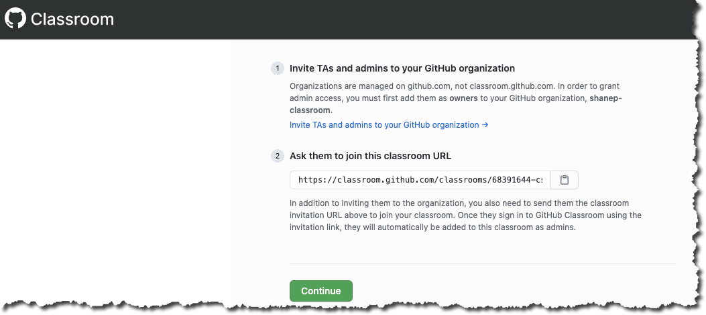
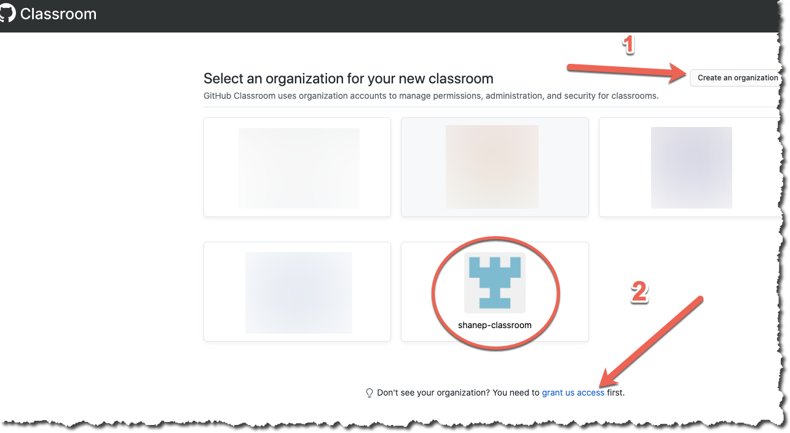
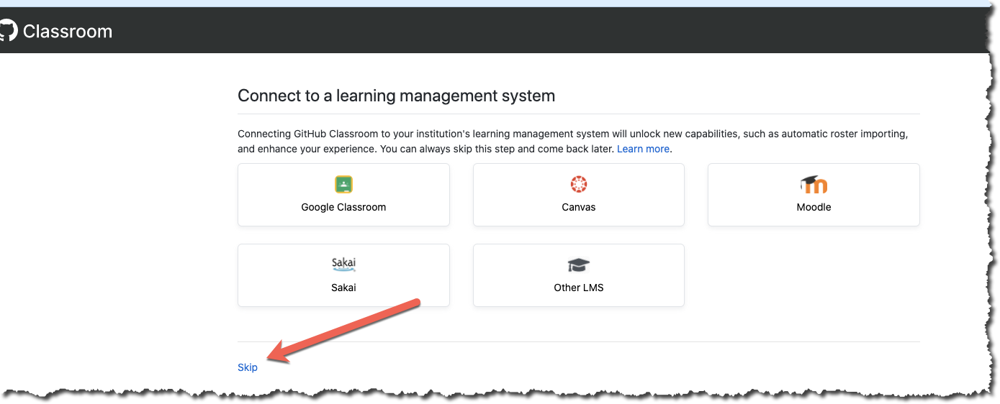
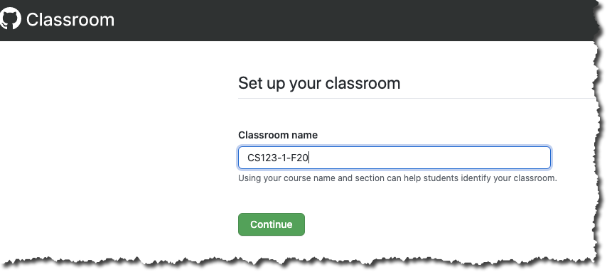
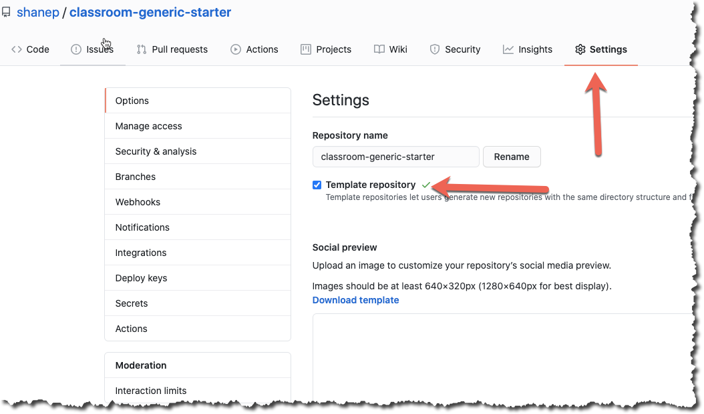
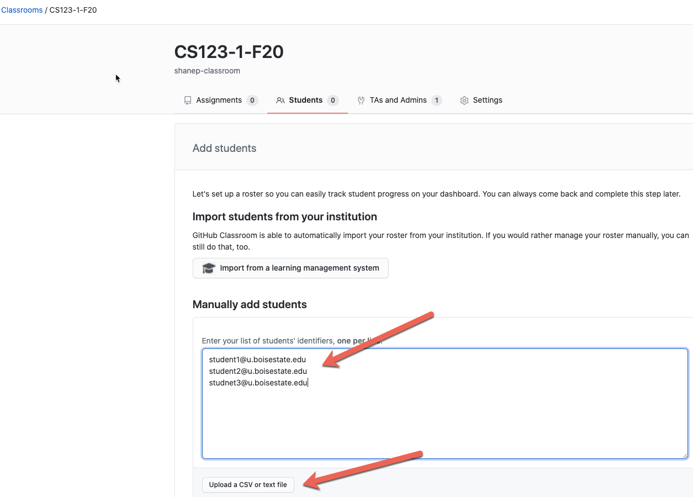
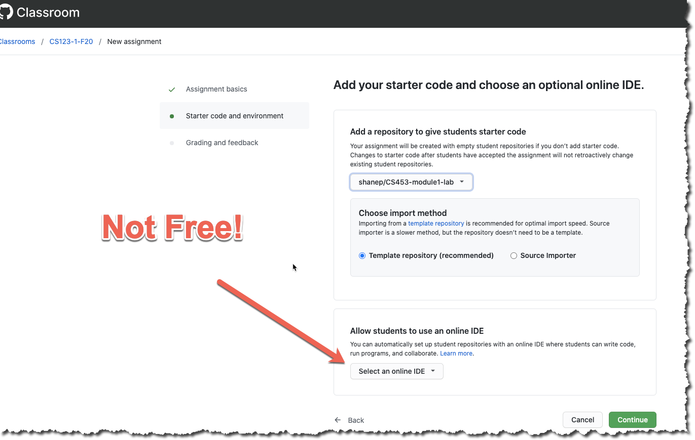
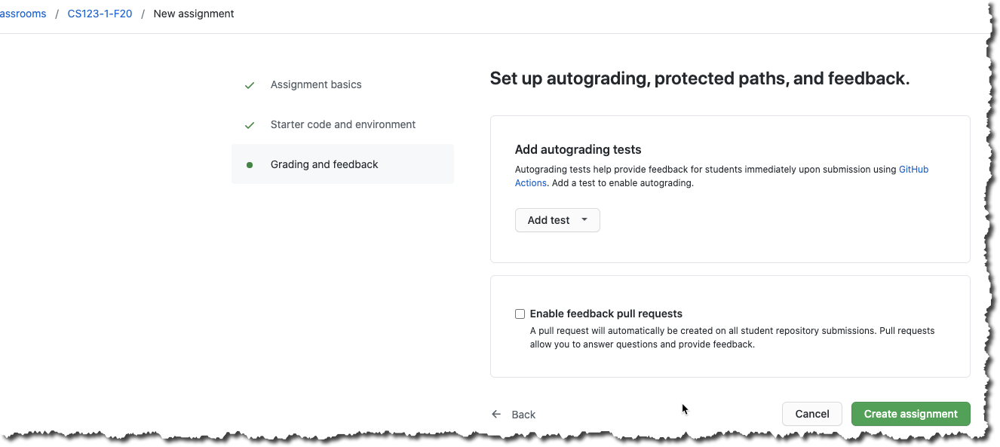
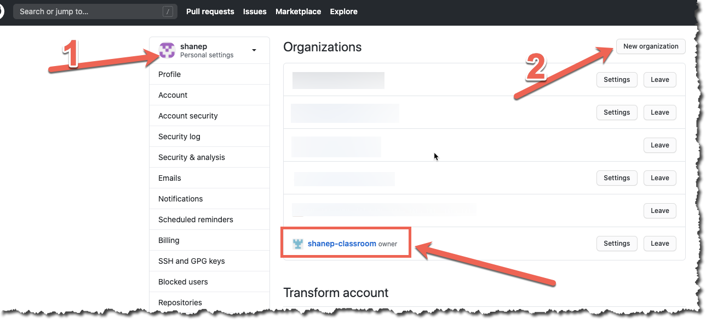
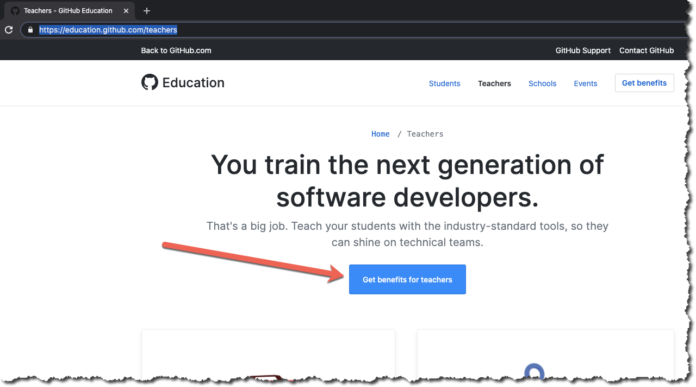

# Instructor Quickstart

- Log into your personal Github account, do not use the Boise State
  corporate account.
- Create a new organization that is associated with your personal
  account. You need to use your personal account NOT the Boise State
  account because TA’s and GA’s must be added as owners of the
  organization and we can’t have TA’s or GA’s as owners of the Boise
  State organization because they could access everyone's private
  repositories.
- Once you have created an organization on your personal account you
  can select it for a new classroom
- (optional) Create a template repository on your personal account
  with any starter code for your assignment.
- Create a new class on https://classroom.github.com
- Create as many assignments as you wish using any started code you
  created

## Detailed walk through

Below are the steps to get started with Github classrooms. Creating a
new organization only needs to be done once. You can re-use the same
organization for all your classrooms.

### Create a new organization

NOTE: It is CRITICAL that you used your personal GitHub account! Do
not use the BoiseState account because you can accidentally expose
private repositories (solutions to exams, assignments, etc.) to your
TA’s and GA’s.

- Sign into your personal GitHub account https://github.com
- Navigate to the organization page
  https://github.com/settings/organizations and create a new
  organization to use with your classroom. For example
  username-classroom.

### Create a starter repo for your assignments

- You should create a starter repo for your assignment to be based on
as it will make your grading easier when everyone has a standardized
directory layout. You can look at an example here:
https://github.com/shanep/classroom-generic-starter
- Make sure to set your starter repo to be a template as shown below.

### Create a new classroom

- Sign into Github classroom at https://classroom.github.com
- Create your own organization to use for your classroom (you can skip
  this step if you have already created an organization
  previously). Make sure that you give classroom.github.com permission
  to use the organization if you don’t see the organization that you
  created (step two in the picture below).

- You can name your classroom whatever you want. A suggested format is
  in the form CS123-X-AAA where x is your section number of your
  class and aaa is the semester and year. For example CS453-1-F20 is
  for CS453 section 1 in the Fall 2020. If you are combining
  multiple sections use X for the section number.

- Add in any TA’s or grad students that you want to your
  organization. NOTE: This step will FAIL if you are using the Boise
  State GitHub account. You will get a message saying “You need to be
  the owner of the Boise State account to do this”. Go back to the
  Create a new organization step and try again.

- For now you need to skip the step “Connect to a learning management
  system” because BSU OIT has not implemented this on our end yet. You
  will have to upload your rosters manually (similar to piazza)

- Go into Roster management (Shown below) and update your student
  roster. You can manually input them, upload a CSV or text file,
  etc. The process is similar to piazza.

- Create an assignment for your class as a group assignment or
  individual. It is recommended that you do not give your students
  admin access unless you absolutely know you need that feature. Admin
  access is necessary if you want students to install any GitHub apps
  into their repositories (travis-ci, appveyor, etc.)

- (Optional) Add in starter code for you students. The online IDE
  feature is unfortunately not free so don’t select it because
  students may think they have to buy a subscription.

- (Optional) Add in any autograded tests you want as github actions.

- Get the assignment URL and send it to students (email, blackboard,
  telegram, etc.)

## Download the assignments

### GUI (recommended)

Use the downloader provided by GitHub called Classroom Assistant

### Command line (advanced)

The command line downloader is this project, follow the build
instructions in the root README and install in your local path.

## (optional) Get an education account at Github

Go to https://education.github.com/teachers and follow the steps to
get an education account. This will give you access to other goodies
that you would normally have to pay for :)

